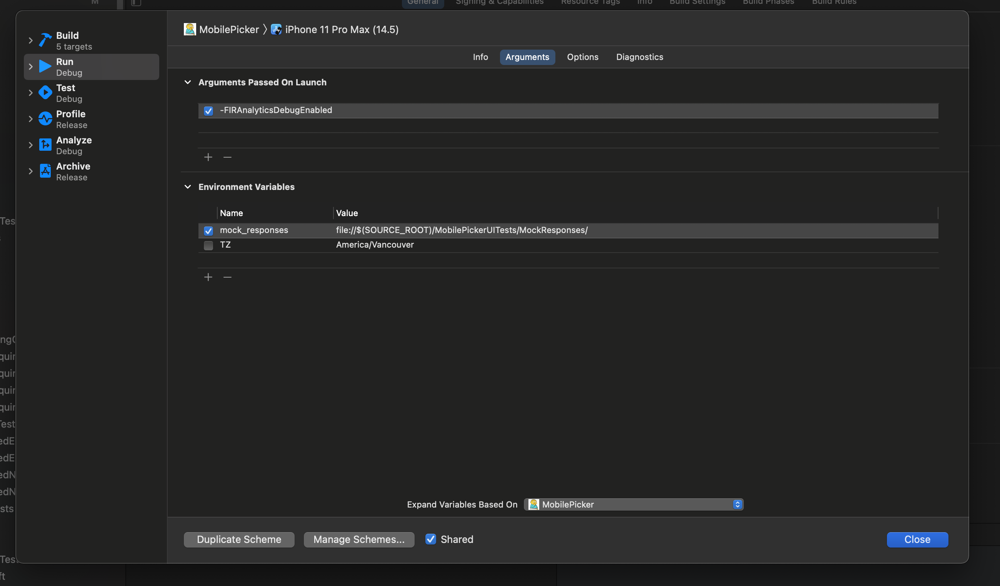
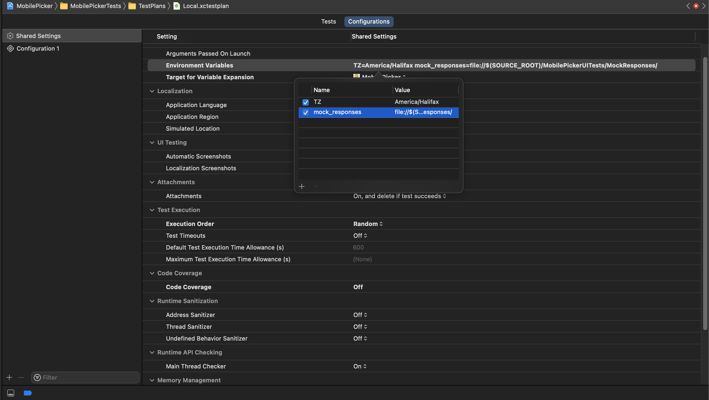

# Pigeon Networking Service
Pigeon is a Networking Library which will be used across iOS teams in LD for making REST-ful API calls.

## Pre-reqs

If your minimum OS version to support is iOS 13+, then you're good to go.
- Pigeon uses `Combine` which was introduced in the iOS 13 SDK

## Setup

To setup the Pigeon SP in your xcode project:
1. Copy the repo URL:
```
ssh://git@gitlab.lblw.ca:2222/mobile/ios/shared/swiftpackages/api-service.git
```
2. Open your project in Xcode, navigate to `File > Swift Packages > Add Dependency`
2. Paste the repo URL and hit next 
2. Select the rules for dependency pinning and hit next
    - *It is highly recommended that you pin to ***EXACT*** version so a new version does not cause a disruption to your builds and upgrading is a concious decision*
2. Done!

## Enabling SPM access for CI

To enable access to Pigeon SPM for your Bitrise pipeline, do the following:
1. Navigate to your project in Gitlab from a browser
1. Click on `Settings > Repository > Deploy keys`
1. Select the `Privately accessible deploy keys` tab
1. Find the deploy key of your bitrise pipeline and hit `Enable`
1. Your deploy key should show up in the `Enabled deploy keys` tab
1. Done! Run your pipeline - your Bitrise VM should now have access to Pigeon SP

## Usage

### How to make a simple GET request?

Easy!

1. Import Pigeon

```swift
import PigeonService
```

2. Create an instance of `APIService` with the required params like; `baseURL` and an instance that conforms to `URLSessionType` and a `Dictionary` of `defaultHeaders` that would be passed in with every HTTP request.
    -  The confromance for `URLSession` exists in Pigeon so an instance of it (eg; `URLSession.shared`) can be used to pass-in off the bat.

        ```swift
        let urlSession = URLSession.shared
        let apiService = APIService(
            baseURLString: Server.production.urlString,
            urlSession: urlSession,
            defaultHeaders: .init(
                headers: .acceptLanguage(Locale.current.languageTag), .contentType(.json)
            ),
			errorType: { Your custom error type }.self
        )
        ```
2. Define the request by conforming a `struct` (preferred) or `class` to `APIRequestType` protocol

    ```swift
    import PigeonService

    struct FetchOrderRequest: APIRequestType {
        typealias Body = EmptyBody /* request body type that confroms to Encodeable */
        typealias ResponseBody = OrderAPIModel /* expected response body type that confroms to Decodable */ 

        let method: HTTPMethod = .get /* HTTP method */
        let path: String /* API endpoint to be suffixed on the baseURL */
        let body: Body = EmptyBody() /* request body - In this case no body is needed so using an instance of EmptyBody (a Pigeon type) */

        init(orderNumber: String, storeID: String) {
            path = "/api/v1/stores/\(storeID)/orders/\(orderNumber)"
        }
    }
    ```
3. Fire off the request and expect an `AnyPublisher` in return with the `Output == ResponseBody` defined in the request instance provided

    ```swift
    func fetchOrder(orderNumber: String, storeID: String) -> AnyPublisher<OrderAPIModel, Error> {
        apiService.send(FetchOrderRequest(orderNumber: orderNumber, storeID: storeID))
            .eraseToAnyPublisher()
    }
    ```

4. Done!

### How to make use of mock JSON functionality?

Pigeon supports mock responses instead when doing integration tests. It also supports recording integration tests which makes maintaining mock responses super easy!

There's two different implementations of `URLSessionType`:
- `MockURLSession`: requires an optional path to the `directory` where it can find the mock responses. If not provided - it will look for them in a folder called `default`
- `RecordURLSession`: accepts an instance conforming to `URLSessionType` which it uses to make fetch the responses

Both `MockURLSession` and `RecordURLSession` use the file system the tests/app is running on to read/create responses. It expects the path to where all the responses will be found in a `Environment Variable` called `mock_responses`.

*Record Mode in action:*


Heres how to set it up:

1. Go into the `Edit Scheme > Run` and add `mock_responses` variable to `Envrionment Variable` and set it to
    ```
    file://$(SOURCE_ROOT)/<PATH TO MOCK RESPONSES INSIDE PROJECT>
    ```
    

1. Do the samething for your UITest suite by adding `Envrionment Variable` to your test plan (or the test target if not using test plan).

    

1. Now to configure the app to use the `MockURLSession`, we can use XCUITest's launch arguments to pass a flag (and also a per-test based path) for mock responses. The flags can be read in the `SceneDelegate` and the app can be configured based on the values. For example:

    ***Test Suite:***
    ```swift
    app = XCUIApplication()
    app.launchEnvironment = [
        "testCasePath": mockResponses + name.createDirectoryPath(), /* creating a per-test based path to mock responses and passing that into the */
    ]
    ```
    ***App code - SceneDelegate***
    ```swift
    if let path = ProcessInfo.processInfo.environment["testCasePath"] {
        /* Update the urlSession in APIService to MockURLSession with the directory set to testCasePath */
    }
    ```

1. In a similar manner configure the app to use the `RecordURLSession` when you want to record the responses.
    - One way to do this is to have a button in your that uses the `#if DEBUG` or `#if targetEnvironment(simulator)` compile time macro to only be available in debug builds. Pushing the button changes the `urlSession` in the `APIService` to `RecordURLSession`
    ```swift
    #if targetEnvironment(simulator)
    Button(
        action: { /* Update the urlSession in APIService to RecordURLSession */ },
        label: { Text("Record Mode") }
    )
    #endif
    ```

[LEARN MORE ABOUT MOCKING](./README/Mocking.md)

# Want to Contribute?

## You'll need

- Xcode 11+ (iOS 13+ SDK)
    - *Newest version recommended*

## How to develop for Pigeon

The development workflow for Swift Packages can be a little complicated - particularly if you're wanting to test our your changes in your consumer application.

Follow these steps to point your consumer application project to your local Pigeon repo for faster iteration:
1. Open your consumer application's Xcode project
    - It should be pinned to a version and pointing to the repo
1. Drag the root folder of Pigeon and drop it under your project in the `Project Navigator`
1. Pigeon now disapper from your list of Swift Package depedencies and instead appear as a expandable SP under your project
    - ***NOTE THAT YOU SHOULD NOT HAVE THE PACKAGE OPEN IN ANOTHER INSTANCE OF XCODE.*** The local reference in the project doesn't appear to be expandable otherwise. It currently seems to be a quirk that exists in Xcode which might get fixed in a future update.
1. You should now be able to update Pigeon and your consumer application as well as deploy to simulator/device with your changes for testing without having to push changes to the SP repo.

## Branching Strategy/MR flow to follow

1. Name your branch like `feature/[JIRA_Ticket_Number or feature name]` (can also do `bug/[JIRA_Ticket_Number or bug name]` if working on a bug)
1. If the work in your branch is to be released as a new version immediately - create an MR for `master` and fill out the MR template (presented when creating an MR)

## Making a release

To make a release create a tag once the MR has been merged in `master`.
- Use a major version update if there are breaking changes/deprecations/major changes in code that could eg; `1.x.0`
- Use a minor version update for small bug fixes/additive changes to APIs etc eg; `1.0.x`
