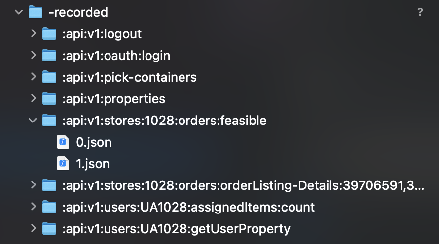
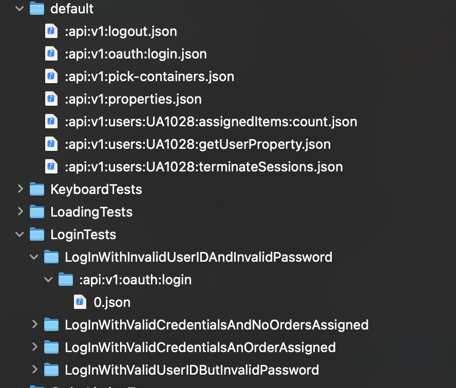

# RecordURLSession

When record mode is turned on, each request/response that comes in is dumped into a JSON file. Each incoming request increases a counter so multiple requests for the same request can be stored to create complex playback scenarios.

The received responses are stored in a folder called `-recorded`. Each unique endpoint corresponds to a folder named as the `path` of the request. Inside, the numbered json responses are stored corresponding to the iteration of each request.

# MockURLSession

When read mode is turned on, the `MockURLSession` searches for the incoming requests in the path set in the `Environment Variables` + the `directory` path provided. If the `directory` is not found then, it falls back to looking for the mock json in the `default` folder.

